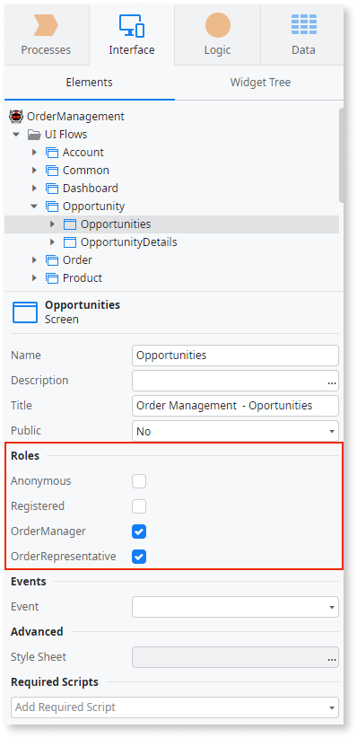
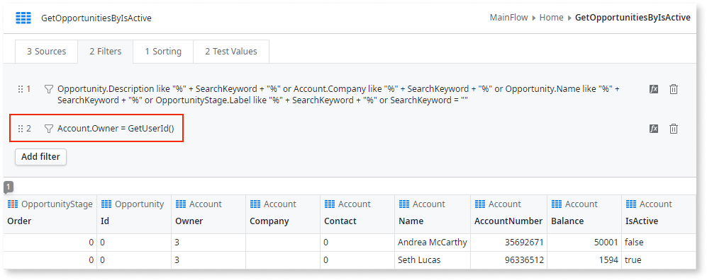
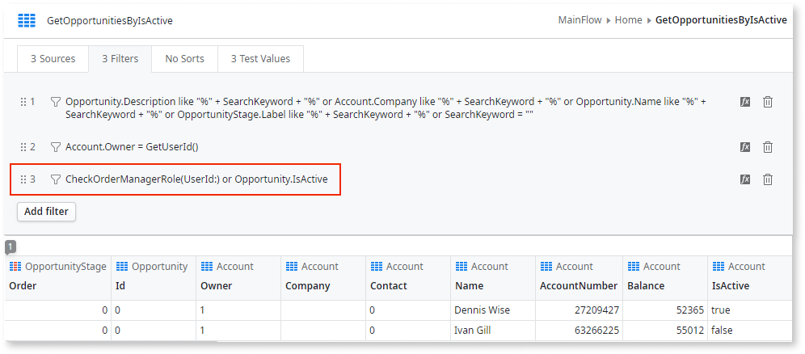
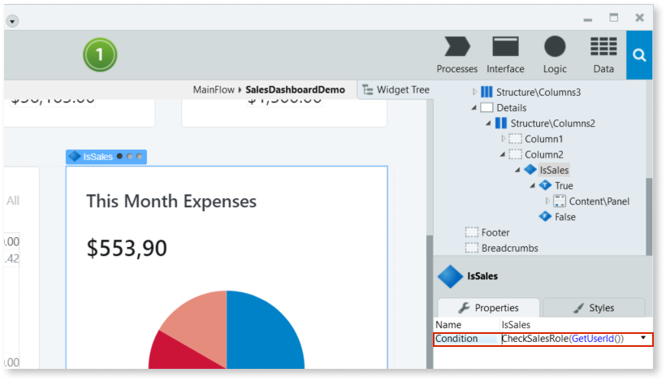
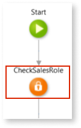
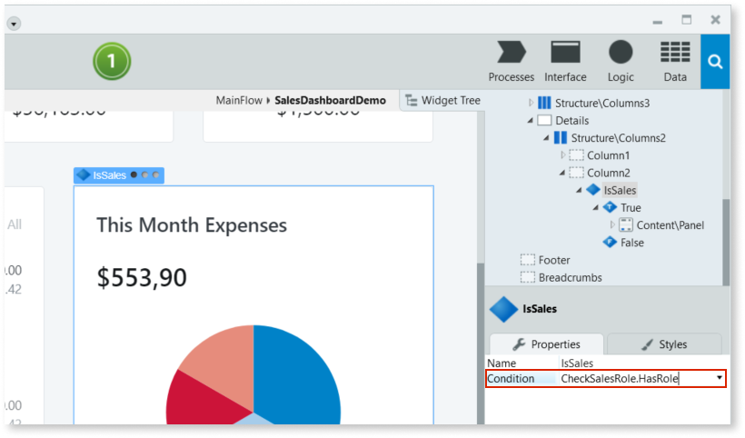
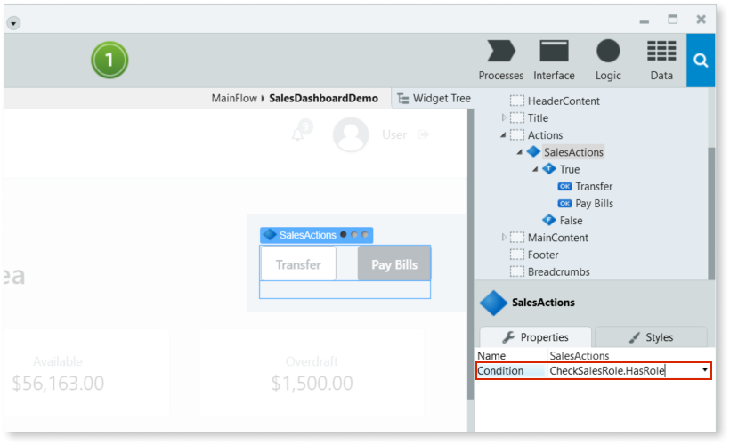

# Validate End User Permissions in the Application

You can restrict end-user access to specific areas, operations or data of an app.

By validating their user ID or Roles you can control access to screens, screen elements or actions. It's also possible to restrict access to data depending on the logged in user or their role.

## Restricting access to screens, processes, and actions

To restrict access to a screen of an app, in the **Roles** property of the screen select the end user Roles that can view the screen.

**Note**: **Anonymous screens** generate public endpoints which is a  security risk as it can lead to cross-site request forgery attacks. For more information, see [Security Warning](../../ref/errors-and-warnings/warnings/security-warning.md). 

To restrict access to screen elements or actions of a screen, use the **Check&lt;Role_name&gt;Role** action or function to determine if the end user has the necessary Role.

## Restricting access to data

You can also restrict access to data based on the user ID or the user Role.

In this next example, `GetUserId()` was used so that account owners can only see the opportunities of their own accounts:

To restrict the displayed data by Role, use **Check&lt;Role_name&gt;Role** in an expression on an aggregate filter.

In this next example, we're checking for the OrderManagerRole to restrict visibility over inactive opportunities. When the **Check&lt;Role_name&gt;Role** evaluates to false, only active opportunities are shown:

## In Traditional Web

If you only need to check for a Role **once** in a screen, you can use a `Check<Role_name>Role` function directly in the **Condition** of an **If** widget.

If you need to check for the same Role **more than once** in the same screen, follow these steps:

1. In the **Preparation** of the screen, add the **Check&lt;Role_name&gt;Role** action, and set the **UserId** to `GetUserId()`.

    

1. Use the **Check&lt;Role_name&gt;Role\.HasRole** output, to hide interface elements and restrict access to actions, for example:

    * Hide or display interface elements using an **If** widget with a `Check<Role_name>Role.HasRole` **Condition**.

        

    * Block or allow executing actions by hiding the Buttons or Links that call the actions, using an **If** widget with a `Check<Role_name>Role.HasRole` **Condition**.

        
